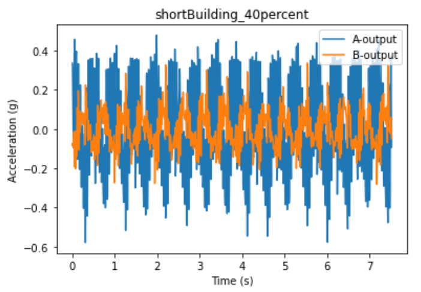

# Earthquake Data Analysis

### Made for engineering class.

To use this, add the data as a csv file titled `data.csv` in the same directory as the python file. The data should have 3 columns: `Time (s)`, `A-output`, `B-output`. The program will then convert the `data.csv` file into two separate files: `A-output.wav` and `B-output.wav`. The frequency is then found using these `.wav` files through a Fast Fourier Transform and Autocorrelation. The program will then output the frequency in Hz. The frequency might be different for the two methods, usually one is correct so pick the one that seems more reasonable. _ie do not pick the one that is more than 10 Hz unless it somehow matches your data_. The program will also compute the maximum absolute value for each output, which is the maximum acceleration.

### Sample Data Output

    Analyzing A-output
    Calculated frequency from FFT: 21.010746 Hz
    Calculated frequency from autocorrelation: 2.101787 Hz
    Maximum Acceleration: 0.57968

    Analyzing B-output
    Calculated frequency from FFT: 2.098361 Hz
    Calculated frequency from autocorrelation: 0.525113 Hz
    Maximum Acceleration: 0.336365

Source: https://gist.github.com/endolith/255291
